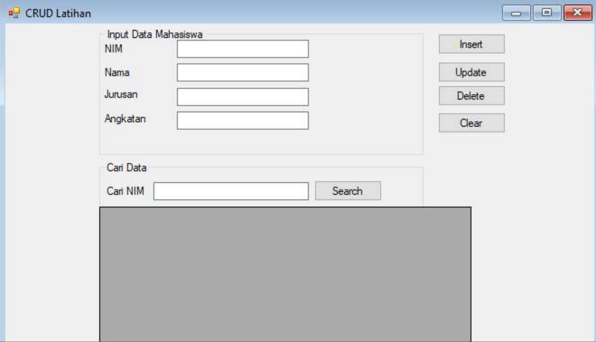
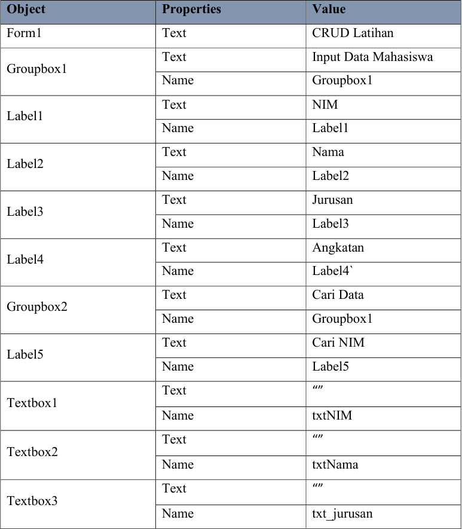
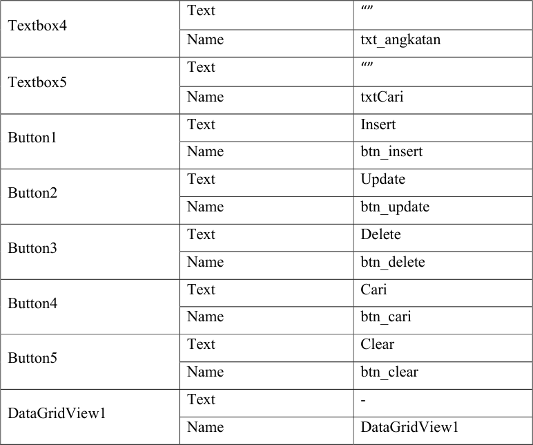
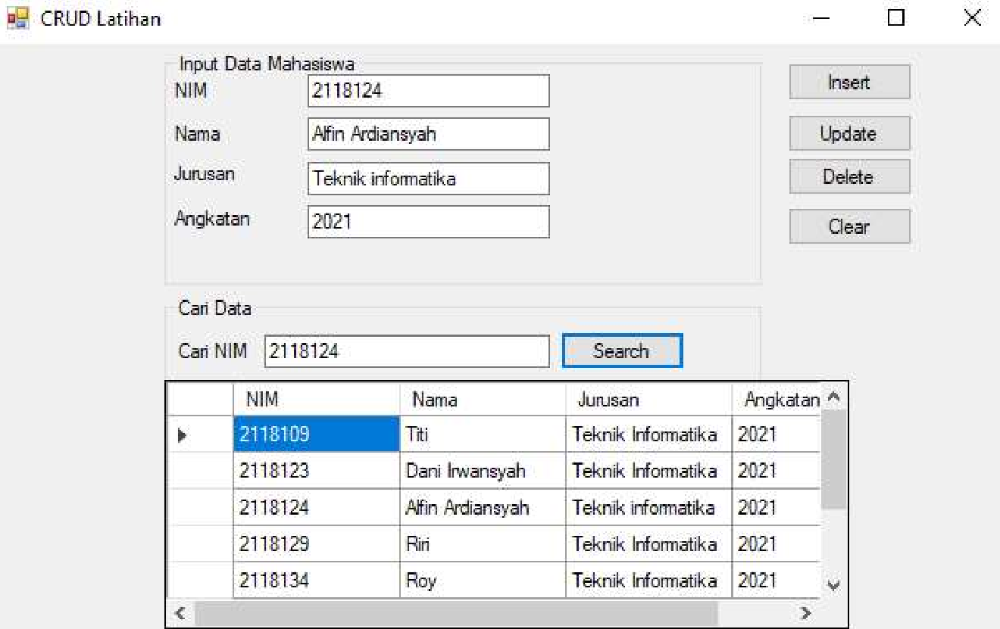

# Pertemuan 8

## Pengertian CRUD

Pengertian CRUD
CRUD merupakan singkatan dari Create, Read, Update, dan Delete. Keempat
komponen ini merupakan perintah dengan peran yang esensial dalam sebuah aplikasi
database yang memiliki sifat relational.


Beberapa contoh DBMS (Database Management Sustem) yang menggunakan CRUD
sebagai fungsi utamanya yaitu Oracle Database, Microsoft SQL Server, MySQL,
PostgreSQL, dan sebagainya.

## Fungsi CRUD

Pada dasarnya, keempat komponen ini merupakan pondasi kerja sebuah database
agar operasional data dalam sebuah pemrograman dapat dilakukan pendataan yang
efektif.

Berikut penjelasan tentang fungsi-fungsi dalam CRUD :

## 1. Create
Fungsi Create berfungsi untuk membuat data entry atau record baru dalam
sebuah table pada sebuah database. Dalam aplikasi berbasis SQL, fungsi Create
seringkali disebut dengan insert. Sederhananya, Ketika membuat table atau data
baru sesuai dengan atribut yaitu menggunakan fungsi Create. Akan tetapi, fungsi ini
hanya bisa digunakan pada posisi administrator saja yang dapat menambah atribut
lain kedalam table itu sendiri.

## 2. Read
Fungsi Read ini berguna untuk membaca entry data yang sudah terdaftar pada
sebuah databasae. Akan tetapi fungsi ini tidak akan memberikan akses untuk
mengubah data yang sudah tersimpan dalam sebuah database. Fungsi Read
mempunyai kesamaan dengan fungsi search yang biasa ditemukan pada berbagai
perangkat lunak. Hal yang perlu dilakukan adalah dengan menggunakan kata
kunci(keyword) untuk dapat menemukan file record dengan bantuan filter data
berdasrkan kriteria tertentu.

## 3. Update
Fungsi Update ini berperan penting untuk memperbarui suatu entry data
Ketika informasi didalamnya memerlukan suatu perubahan, Dengan fungsi ini user
dapat mengubah detail pada sebuah entry didalam database sesuai dengan
kebutuhan user. Untuk pengisian update data, user perlu juga menyesuaikan nilai
atribut agar sesuai dengan form yang tersedia agar tidak ada kesalahan dalam
pemrosesan data didalam server.

## 4. Delete
Fungsi Detele ini berperan untuk menghapus data entry yang sudah tidak
diperkukan dalam sebuah database. Ketika user menggunakan fungsi ini, user akan
dapat mengakses detail sebuah data entry dan kemudian memberikan perintah
kepada system untuk menghapusnya dari database.

## Cara Kerja CRUD

untuk pengaplikasian dari fungsi ini perlu diperhatikan dalam penyusunan fungsi
tersebut bahwa user telah terkoneksi dengan database.
Berikut Cara Kerja pada CRUD :
1. Rute apa yang perlu user terapkan untuk menyediakan model dengan fungsionalitas CRUD inni dan apa kata kerja HTTP yang sesuai.
2. Apa pengaruh setiap rute terhadap database.
3. Badan Respon apa yang dikembalikan setiap rute
4. Kode respon apa yang akan dikembalikan setiap rute.

## Latihan

### 1. Buatlah Desain Form Seperti Berikut :



**Atur properties setiap komponen seperti pada table berikut:**




### 2. Masukan Source Code Berikut pada Form sebagai library:

```basic
Imports System.Data.SqlClient
```

:::info[catatan]
`Kode import` di letakkan di luar Class Form, di letakkan paling atas.
:::

### 3. Tambahkan Source Code berikut dibawah public class sebagai deklarasi variable:

```basic
Dim Conn As SqlConnection
Dim Da As SqlDataAdapter
Dim Cmd As SqlCommand
Dim Ds As DataSet
Dim Rd As SqlDataReader
Dim MyDb As String
```

### 4. Buatlah Procedure untuk mengkoneksikan SQL Server dengan Visual Basic

```basic
Sub Koneksi()
    MyDb = "Data Source=IDEAPAD-3; initial catalog=bab8;integrated security=true"
    Conn = New SqlConnection(MyDb)
    If Conn.State = ConnectionState.Closed Then Conn.Open()
End Sub
```

:::info[catatan]
Pada bagian `Data Source` sesuaikan dengan *Server Name* pada Sql Server anda.

Pada bagian `initial catalog` sesuaikan dengan nama database anda.
:::

### 5. Buatlah Procedure Clear dibawah Sub Koneksi

```basic
Sub Clear()
    txtNIM.Clear()
    txtNama.Clear()
    txt_jurusan.Clear()
    txt_angkatan.Clear()
End Sub
```

### 6. Buatlah Procedure Kondisi Awal dibawah fungsi clear

```basic
Private Sub KondisiAwal()
    Call Koneksi()
    Call Clear()
    Da = New SqlDataAdapter("select * from tb_mahasiswa", Conn)
    Ds = New DataSet
    Ds.Clear()
    Da.Fill(Ds, "tb_mahasiswa")
    DataGridView1.DataSource = Ds.Tables("tb_mahasiswa")
End Sub
```

:::info[catatan]
Pada bagian `tb_mahasiswa` sesuaikan dengan nama tabel yang anda buat.
:::


### 7. Tambahkan Source Code berikut untuk membuka koneksi database dan memasukan datasource ke DataGridView1

```basic
Private Sub Form1_Load(sender As Object, e As EventArgs) Handles MyBase.Load
    Call Koneksi()
    Da = New SqlDataAdapter("select * from tb_mahasiswa", Conn)
    Ds = New DataSet
    Ds.Clear()
    Da.Fill(Ds, "tb_mahasiswa")
    DataGridView1.DataSource = Ds.Tables("tb_mahasiswa")
End Sub
```

### 8. Masukan Source Code Berikut di Button Insert

```basic
Private Sub button_insert_Click(sender As Object, e As EventArgs) Handles button_insert.Click
    If txtNIM.Text = "" Or txtNama.Text = "" Or txt_jurusan.Text = "" Or txt_angkatan.Text = "" Then
        MsgBox("Lengkapi data terlebih dahulu", MsgBoxStyle.Critical, "Failed")
    Else
        Call Koneksi()
        Dim inputData As String = "INSERT INTO tb_mahasiswa VALUES ('" & txtNIM.Text & "','" & txtNama.Text & "','" & txt_jurusan.Text & "','" & txt_angkatan.Text & "')"
        Cmd = New SqlCommand(inputData, Conn)
        Try
            Cmd.ExecuteNonQuery()
            MsgBox("Data Berhasil Di Input", MsgBoxStyle.Information, "Information")
            Call KondisiAwal()
        Catch ex As Exception
            MsgBox("Error: " & ex.Message, MsgBoxStyle.Critical, "Failed")
        End Try
    End If
End Sub
```

### 9. Masukan Source Code Berikut di Button Update

```basic
Private Sub button_update_Click(sender As Object, e As EventArgs) Handles button_update.Click
    If txtNIM.Text = "" Or txtNama.Text = "" Or txt_jurusan.Text = "" Or txt_angkatan.Text = "" Then
        MsgBox("Lengkapi data terlebih dahulu", MsgBoxStyle.Critical, "Failed")
    Else
        Call Koneksi()
        Dim updateData As String = "UPDATE tb_mahasiswa SET nim = '" & txtNIM.Text & "', nama='" & txtNama.Text & "', angkatan='" & txt_angkatan.Text & "', jurusan='" & txt_jurusan.Text & "' WHERE nim = '" & txtNIM.Text & "'"
        Cmd = New SqlCommand(updateData, Conn)
        Try
            Cmd.ExecuteNonQuery()
            MsgBox("Data Berhasil Di Update", MsgBoxStyle.Information, "Information")
            Call KondisiAwal()
        Catch ex As Exception
            MsgBox("Error: " & ex.Message, MsgBoxStyle.Critical, "Failed")
        End Try
    End If
End Sub
```

### 10. Masukan Source Code Berikut di Button Delete

```basic
Private Sub button_delete_Click(sender As Object, e As EventArgs) Handles button_delete.Click
    If txtNIM.Text = "" Then
        MsgBox("Data NIM tidak di temukan", MsgBoxStyle.Critical, "Failed")
    Else
        Call Koneksi()
        Dim deleteData As String = "DELETE tb_mahasiswa WHERE nim='" & txtNIM.Text & "'"
        Cmd = New SqlCommand(deleteData, Conn)
        Try
            Cmd.ExecuteNonQuery()
            MsgBox("Data Berhasil Di Hapus", MsgBoxStyle.Information, "Information")
            Call KondisiAwal()
        Catch ex As Exception
            MsgBox("Error: " & ex.Message, MsgBoxStyle.Critical, "Failed")
        End Try
    End If
End Sub
```

### 11. Masukan Source Code Berikut di Button Cari

```basic
Private Sub button_cari_Click(sender As Object, e As EventArgs) Handles button_cari.Click
    Call Koneksi()
    Cmd = New SqlCommand("SELECT * FROM tb_mahasiswa WHERE nim='" & txtCari.Text & "'", Conn)
    Rd = Cmd.ExecuteReader
    Rd.Read()
    If Rd.HasRows Then
        txtNIM.Text = Rd.Item("nim")
        txtNama.Text = Rd.Item("nama")
        txt_jurusan.Text = Rd.Item("jurusan")
        txt_angkatan.Text = Rd.Item("angkatan")
    Else
        MsgBox("Data tidak di temukan!", MsgBoxStyle.Critical, "Failed!")
    End If
End Sub
```

### 12. Masukan Source Code Berikut di Button Clear

```
Private Sub button_clear_Click(sender As Object, e As EventArgs) Handles button_clear.Click
    Call Clear()
End Sub
```

### 13. Hasil tampilan



## Tugas

:::warning[Tugas..]
**Tugas membuat program CRUD dengan menggunakan Visual Basic dan SQL Server sesuai dengan tema masing-masing**
:::
